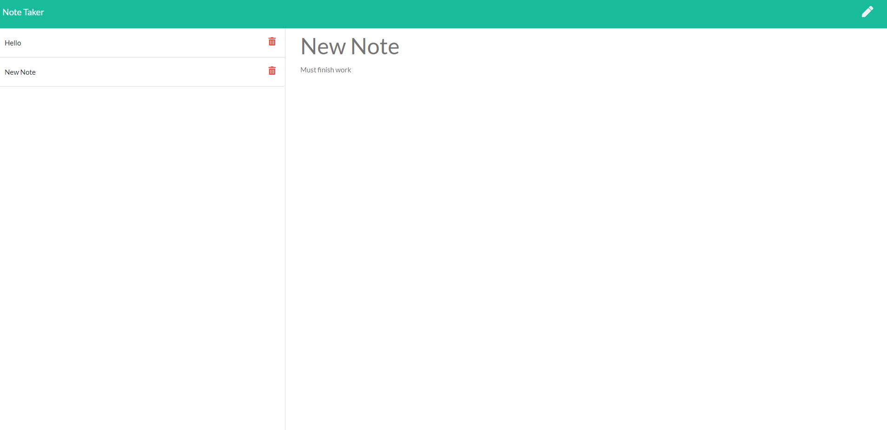

# Note-Taker

## Description

This is the homework for week eleven. The goal is to create a note-taking application where the user can write, save, and delete notes. The main objective is to use express to work on the backend and connect it to the frontend. 

## Installation

In the terminal, use the following commands:

* `npm install`
* `npm install express`

## Screenshots

## Links

* https://github.com/LostandConfusedStudent/Note-Taker
* https://dry-thicket-85836.herokuapp.com/